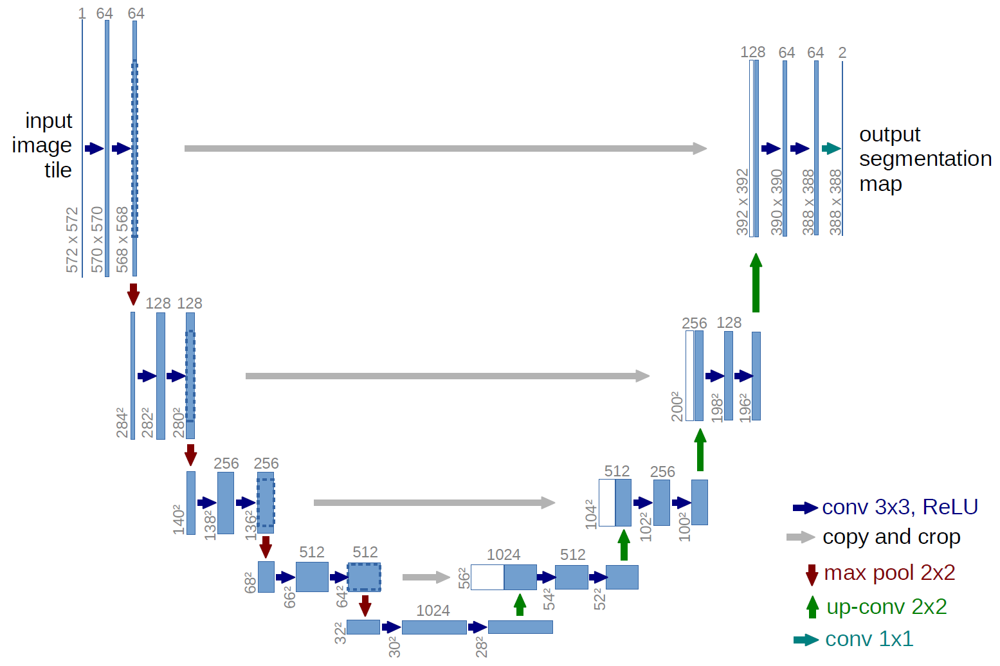

# Building Damage Assessment 

[Source: Maxar images](!maxar.com/open-data)

## Problem Statement
As a Data Scientist working for the United Nations, we've been tasked with creating a predictive model for assessing building damage from satellite images of natural disasters.

Assessing building damage after a disaster has struck is very important for disaster response and management in order to prevent significant losses to life as well as property. However, these natural disasters often impact large areas and access to these areas may not be possible.

`Using pre and post disaster satellite images of different buildings and locations can we predict the level of damage of a building?`

## Methodology

The dataset used for this project is the Xview2 challenge dataset which can be obtained from https://xview2.org/dataset. It contains pre and post disaster images of natural disasters as well as metadata which is a json file containing damage levels and coordinates of buildings. The different natural disasters present can be seen in the graph below:

There are two main goals for this project:
1. Detecting buildings in the images
2. Classifiying the level of damage.

Firstly, masks were created for the images and then patches were created for the images and masks, which were then used in the models.

The models used in the project are Res-Net and U-Net. These models are used for classification and image segmentation problems. 

  

### Residual Networks (Res-Net)
It was proposed in 2015 by researchers at Microsoft Research to solve the problem of vanishing/exploding gradient. It has a technique called `skip connections` which skips training from a few layers and connects directly to the output. The advantage of this is that if any layer reduces performance of the architecture it will be skipped by regularization.

[Source: ResNet](!https://www.geeksforgeeks.org/residual-networks-resnet-deep-learning/)

  

### UNet
It was first designed and applied in 2015 to process biomedical images. It is not only used for image classification but also for image localisation. The reason it is able to localise is that it is able to distinguish borders by doing classification on every pixel.

[Source: UNet](!https://towardsdatascience.com/unet-line-by-line-explanation-9b191c76baf5)

[Resnet and Unet images](!https://aditi-mittal.medium.com/introduction-to-u-net-and-res-net-for-image-segmentation-9afcb432ee2f)

The images were first masked with the shapes of the polygons from the metadata and then image segmentation was carried out on the images using ResNet and UNet and levels of damage were classified.

The building damages were assessed according to a scale (Joint Damage Scale) provided for the XView2 challenge.

#### Pre Disaster Image

#### Post Disaster Image

## Conclusion and Recommendations
The final model which was the unet model was able to achieve an overall f1 score of 0.83 for localisation and 0.70 for classifiying the damage level.The model successfully identified undamaged buildings with an f1 score of 80% an predicts 3 damage classes (minor, major damage and destroyed) with 37.7%, 66.2% and 74.2% and f1 scores respectively.

One of the drawbacks for the project was the cloud cover in the images which made predictions harder. Also, to reduce computing time the patches with no buildings can be removed.

Further testing can be done to determine the transferability of the model to other geographic areas and also the viability of introducing other kinds of images like social media images.